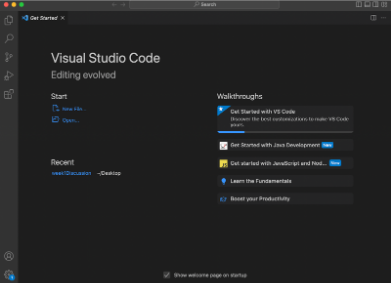
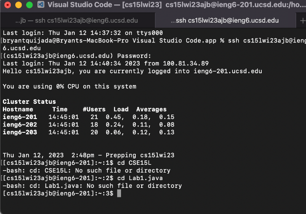
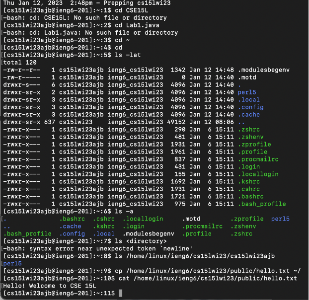

Week 1 Lab Report: Logging into a course-specific account on ieng6

(Step 1): Installing VScode 

  * First, go to the Visual Studio Code website: [https://code.visualstudio.com/](https://code.visualstudio.com/)
  * Then, download and install the version of Visual Studio Code that is applicable to your device 
  * Finally, after Visual Studio Code is installed, you will be able to open it and will look similar to the image below:
  * 

(Step 2): Remotely Connecting

  * First, open a terminal in Visual Studio Code and type the command `ssh cs15lwi23zz@ieng6.ucsd.edu` (replace 'zz' with the letters of your course specific account)
  * Then, type yes if you get a message saying, "Are you sure you want to continue connecting (yes/no/[fingerprint])?"
  * Finally, type your password to complete the login process; the end result should look similar to the image below:
  * 
 

(Step 3): Trying Some Commands

  * First, try running different commands such as `cd`, `ls`, `pwd`, `mkdir`, and `cp`
  * Then, after trying different commands, if you want to log out of the remote server, you can use Ctrl-D on your keyboard or type the command `exit` in your terminal
  * Finally, some examples of commands that you can use are `cd ~`, `cd`, `ls -lat`, `ls -a`, and a few other commands that can be seen in the image below:
  * 

