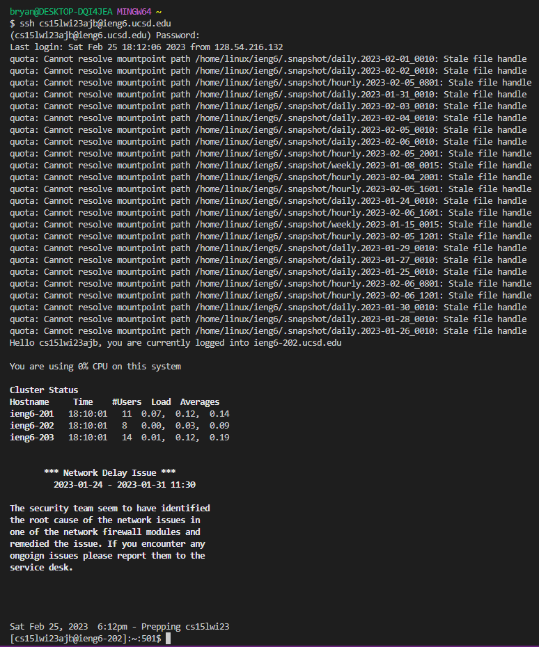
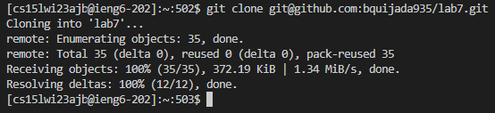
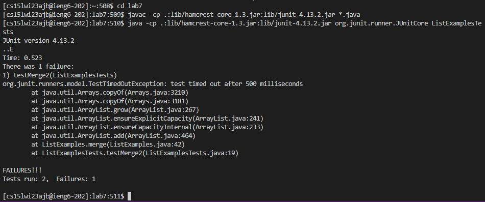
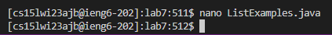
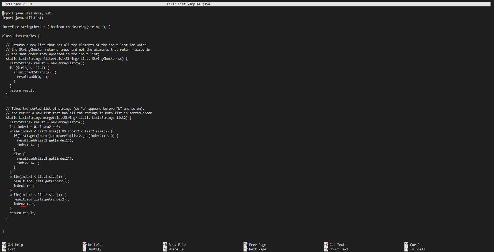
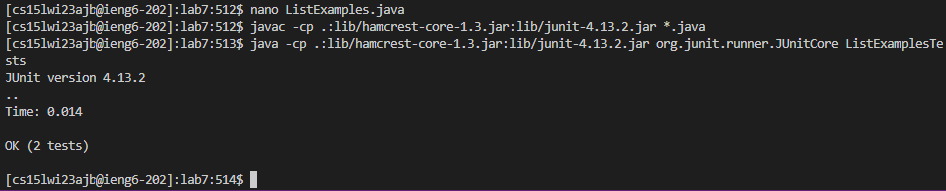
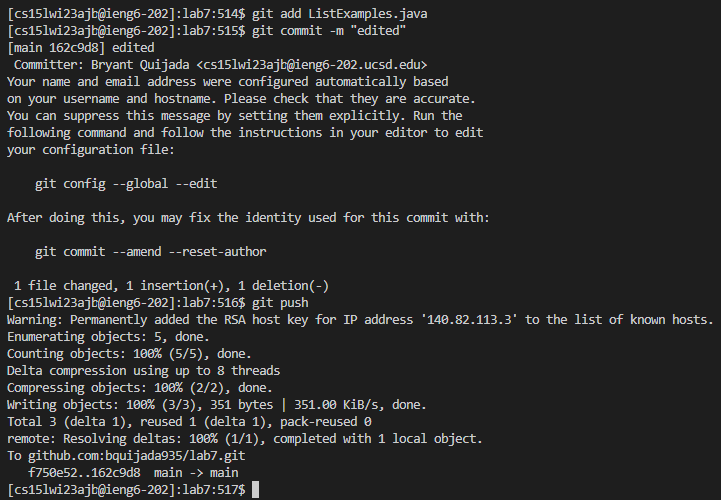

# Lab Report 4

## *Step 4. Log into ieng6:*

  *Step 4 Screenshot:* 
  

  *Keys Pressed:* 
  
   * `<up>`, `<enter>`
  
  *Summary:* 
  
   * The `ssh cs15lwi23ajb@ieng6.ucsd.edu` command was 1 up in the search history, so I used up arrow to access it.

## *Step 5. Clone your fork of the repository from your Github account:*

  *Step 5 Screenshot:* 
  

  *Keys Pressed:* 
  
   * `<Ctrl-R>: git cl`, `<enter>`
  
  *Summary:* 
  
   * I used `<Ctrl-R>` to access my bash history, then I typed `git cl` to access the command `git clone git@github.com:bquijada935/lab7.git`.

## *Step 6. Run the tests, demonstrating that they fail:*

  *Step 6 Screenshot:* 

  *Keys Pressed:* 
  
   * `cd lab7`, `<enter>`, `<Ctrl-R>: javac`, `<enter>`, `<Ctrl-R>: java `, `<enter>` 
  
  *Summary:* 
  
   * I used the command `cd lab7` so I can change the directory to the lab7 cloned repository, then I used `<Ctrl-R>` to access my bash history, then I typed `javac` to access the command `javac -cp .:lib/hamcrest-core-1.3.jar:lib/junit-4.13.2.jar *.java`, then I used `<Ctrl-R>` to access my bash history again, then I typed `java ` to access the command `java -cp .:lib/hamcrest-core-1.3.jar:lib/junit-4.13.2.jar org.junit.runner.JUnitCore ListExamplesTests`.

## *Step 7. Edit the code file to fix the failing test:*

  *Step 7 Screenshot:* 
  

  *Keys Pressed:* 
  
   * `<Ctrl-R>: na`, `<enter>`
  
  *Summary:* 
  
   * I used `<Ctrl-R>` to access my bash history, then I typed `na` to access the command `nano ListExamples.java`.
  
  *Step 7 Screenshot Part 2:* 
  

  *Keys Pressed:* 
  
   * `<down>` (42 times), `<right>` (12 times), `<Backspace>`, `2`, `<Ctrl-O>`, `<enter>`, `<Ctrl-X>`
  
  *Summary:* 
  
   * After being put in the nano text editor, I pressed the `<down>` arrow key 42 times, then I pressed `<right>` arrow key 12 times, then I pressed the `<Backspace>` key and typed `2` to edit the file, then I used `<Ctrl-O>` and pressed the `<enter>` key to to save the file edits, then I used `<Ctrl-X>` to exit the nano text editor.

## *Step 8. Run the tests, demonstrating that they now succeed:*

  *Step 8 Screenshot:* 
  

  *Keys Pressed:* 
  
   * `<Ctrl-R>: javac`, `<enter>`, `<Ctrl-R>: java `, `<enter>` 
  
  *Summary:* 
  
   * I used `<Ctrl-R>` to access my bash history, then I typed `javac` to access the command `javac -cp .:lib/hamcrest-core-1.3.jar:lib/junit-4.13.2.jar *.java`, then I used `<Ctrl-R>` to access my bash history again, then I typed `java ` to access the command `java -cp .:lib/hamcrest-core-1.3.jar:lib/junit-4.13.2.jar org.junit.runner.JUnitCore ListExamplesTests`.

## *Step 9. Commit and push the resulting change to your Github account (you can pick any commit message!):*

  *Step 9 Screenshot:* 
  

  *Keys Pressed:* 
  
   * `<Ctrl-R>: git a`, `<enter>`, `<Ctrl-R>: git co`, `git push` 
  
  *Summary:* 
  
   * I used `<Ctrl-R>` to access my bash history, then I typed `git a` to access the command `git add ListExamples.java`, then I used `<Ctrl-R>` to access my bash history again, then I typed `git co` to access the command `git commit -m "edited"`, then I used the command `git push`.

