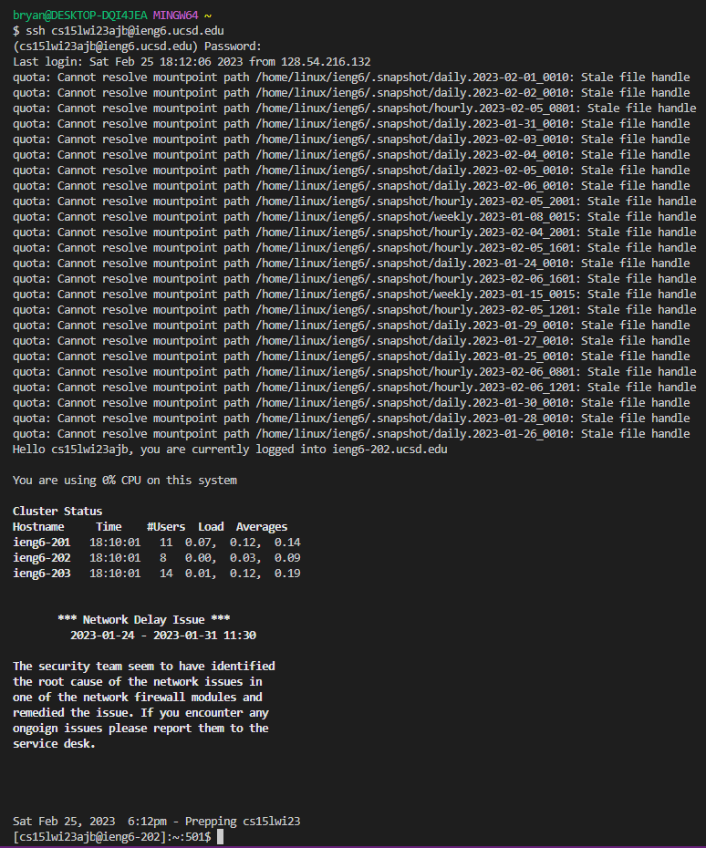
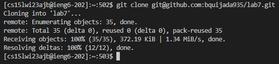
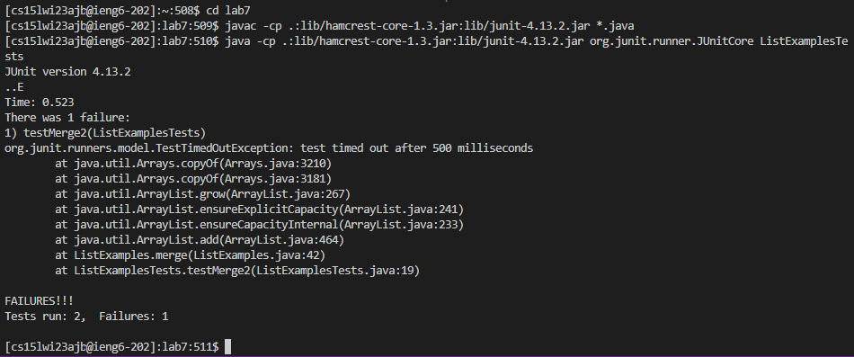
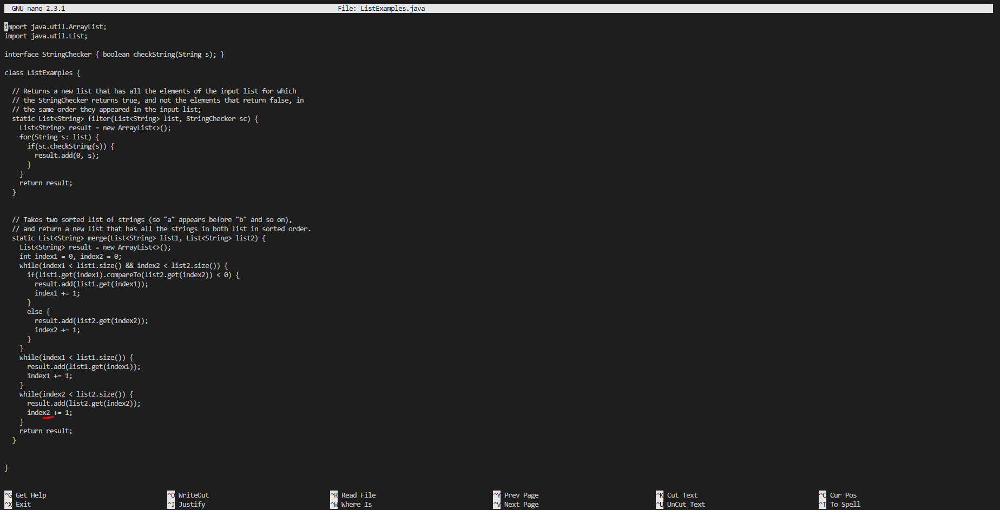
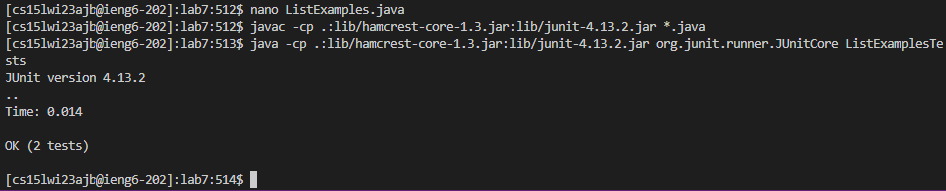
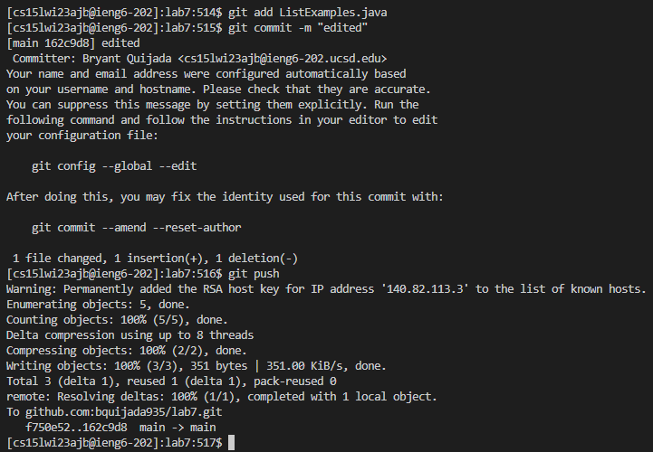

# Lab Report 4

## *4. Log into ieng6:*

  *Step 4 Screenshot:* 

## *5. Clone your fork of the repository from your Github account:*

  *Step 5 Screenshot:* 

## *6. Run the tests, demonstrating that they fail:*

  *Step 6 Screenshot:* 

## *7. Edit the code file to fix the failing test:*

  *Step 7 Screenshot:* 

  
  *Step 7 Screenshot Part 2:* 

## *8. Run the tests, demonstrating that they now succeed:*

  *Step 8 Screenshot:* 

## *9. Commit and push the resulting change to your Github account (you can pick any commit message!):*

  *Step 9 Screenshot:* 

