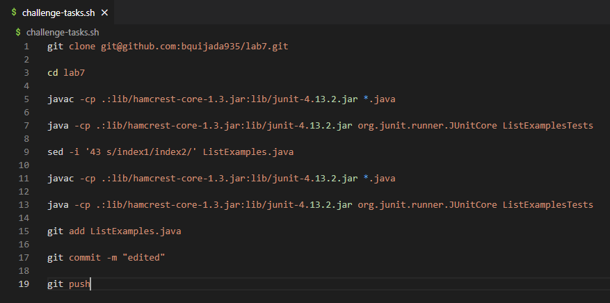
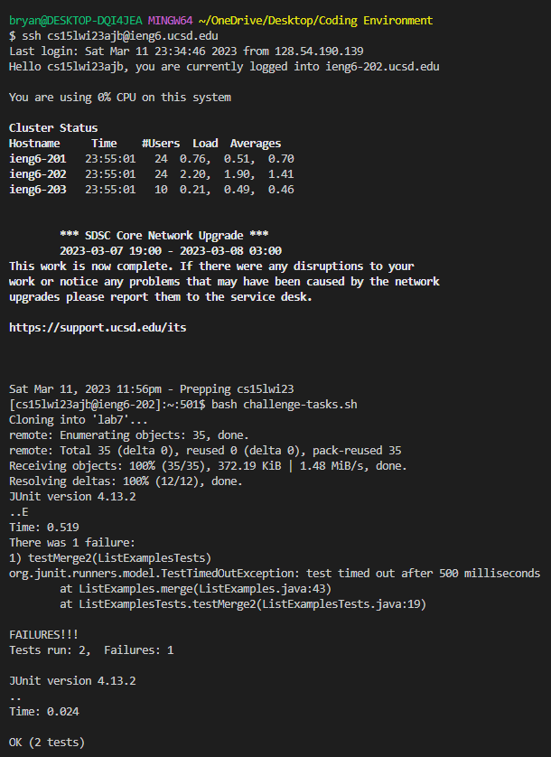
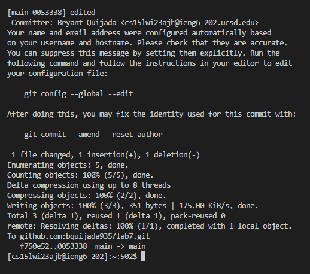

# Lab Report 5

## *Favorite Lab Report: Lab Report 4*

*How was The Original Task Done?:*

  * The original task that was done for Lab Report 4 was to reproduce the task from the Lab 7 competition. The reproduction 
of the task included: "For each numbered step starting right after the timer (so steps 4-9), take a screenshot, and write 
down exactly which keys you pressed to get to that step. For special characters like `<enter>` or `<tab>`, write them in angle 
brackets with code formatting. Then, summarize the commands you ran and what the effect of those keypresses were." 

*What is a Different Way That The Original Task Could Have Been Done?:*

  * A different way I could have done the task very quickly was by writing a bash script. Using a bash script would allow me
to complete the task very quickly since I can write all of the commands on the script and run script instead of typed every
individual command. After writing my bash script (challenge-tasks.sh), I was able to complete the task with only two 
commands which were `ssh cs15lwi23ajb@ieng6.ucsd.edu` and `bash challenge-tasks.sh`. The bash script consisted the commands: 
`git clone git@github.com:bquijada935/lab7.git`, `cd lab7`, `javac -cp .:lib/hamcrest-core-1.3.jar:lib/junit-4.13.2.jar *.java`,
`java -cp .:lib/hamcrest-core-1.3.jar:lib/junit-4.13.2.jar org.junit.runner.JUnitCore ListExamplesTests`, 
`sed -i '43 s/index1/index2/' ListExamples.java`, `javac -cp .:lib/hamcrest-core-1.3.jar:lib/junit-4.13.2.jar *.java`,
`java -cp .:lib/hamcrest-core-1.3.jar:lib/junit-4.13.2.jar org.junit.runner.JUnitCore ListExamplesTests`, 
`git add ListExamples.java`, `git commit -m "edited"`, and `git push`. With this bash script, I was able to condense 10 
commands down to a single command. The keys the was pressed when using the bash script were: `<up>`, `<enter>`, 
`<Ctrl-R>: ba`, `<enter>`. To summarize, the `ssh cs15lwi23ajb@ieng6.ucsd.edu` command was 1 up in the search history, 
so I used up arrow to access it, then I used `<Ctrl-R>` to access my bash history, then I typed `ba` to access the 
command `bash challenge-tasks.sh`. To compare, the original task without the bash script took 11 commands and 81 keys 
pressed to complete the task, while doing the same task with the bash script took 2 commands and 4 keys pressed. An image of
the bash script and an image of the output of redoing the task using the bash script can be seen below:

  *Bash Script Screenshot:* 
  

  *Output of Redoing Task With Bash Script Screenshot 1:* 

  *Output of Redoing Task With Bash Script Screenshot 2:* 

*What is Something That I Learned Later That I Applied To The Same Task?:*

  * Something that I learned later on that I applied to the same task from Lab Report 4 was the use of the `sed` command. The 
`sed` command is a stream editor that has the capabilities of selecting text, substituting text, modifying an original file,
adding lines, deleting lines, and much more. In my case, when I did the same task again, I used the `sed` command for Step 7 
of the Challenge Tasks which involved editing a code file to fix a failing test. The first time I did the task, I used the 
`nano` command. The `sed` command is much faster for completing the task since I only had to type the command 
`sed -i '43 s/index1/index2/' ListExamples.java`. On the other hand the `nano` command was slower for completing the task
since after I typed the command `nano ListExamples.java`, I had to press the `<down>` arrow key 42 times, the `<right>` key 
12 times, then `<Backspace>`, then `2`, then `<Ctrl-O>`, then `<enter>`, then `<Ctrl-X>`.

