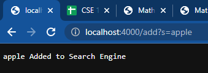
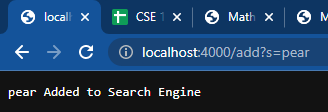
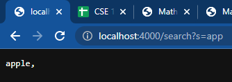

# Week 2 Lab Report


## Part 1

*Code from Simplest Search Engine from week 2 (SearchEngine.java):*
```
import java.io.IOException;
import java.net.URI;
import java.util.ArrayList;

class Handler implements URLHandler {
    
    ArrayList <String> listOfStrings = new ArrayList<>();

    public String returnListOfStrings(ArrayList<String> stringList) {
        String stringOfListOfStrings = "";
        for (int i = 0; i < stringList.size(); i++) {
            if (stringList.get(i) != null) {
                stringOfListOfStrings += stringList.get(i) + ", ";
            }
        }
        return stringOfListOfStrings;
    }

    public String returnListContainingSubString(String subString) {
        String stringOfListOfSubStrings = "";
        for (int i = 0; i < listOfStrings.size(); i++) {
            if (listOfStrings.get(i).contains(subString)) {
                stringOfListOfSubStrings += listOfStrings.get(i) + ", ";
            }
        }
        return stringOfListOfSubStrings;
    }

    public String handleRequest(URI url) {
        if (url.getPath().equals("/")) {
            return "Current List of Strings: " + 
                returnListOfStrings(listOfStrings);
        } else if (url.getPath().equals("/search")) {
            String[] parameters = url.getQuery().split("=");
            if (parameters[0].equals("s")) {
                return returnListContainingSubString(parameters[1]);
            }
            return "404 Not Found!";
        } else {
            System.out.println("Path: " + url.getPath());
            if (url.getPath().contains("/add")) {
                String[] parameters = url.getQuery().split("=");
                if (parameters[0].equals("s")) {
                    listOfStrings.add(parameters[1]);
                    return String.format("%s Added to Search Engine", 
                        parameters[1]);
                }
            }
            return "404 Not Found!";
        }
    }
}

class SearchEngine {
    public static void main(String[] args) throws IOException {
        if(args.length == 0){
            System.out.println("Missing port number! Try any number between 1024 to 49151");
            return;
        }

        int port = Integer.parseInt(args[0]);

        Server.start(port, new Handler());
    }
}
```

*Screenshot 1:*



  * Which methods in your code are called:
    
    * For the first screenshot, the methods that are called are `main` and `handleRequest`.
  
  
  * What the values of the relevant arguments to those methods are, and the values of any relevant fields of the class:
    
    * The relevant arguments to those methods are urls. Other values that are relevant fields of the class are 
the global variable `listOfStrings` and the line of code `Server.start(port, new Handler());` which calls the
Server.java file.
  
  
  * If those values change, how they change by the time the request is done processing:
    
    * If the url value changed, one of four outcomes would occur either a print out a list of all of the strings 
that are stored in the `listOfStrings` variable, a string would be added into the `listOfStrings` variable, a print out of a list of all of the strings in the `listOfStrings` variable that have a given substring, or a print out of a string saying `"404 Not Found!"`.
  
  
*Screenshot 2:*


  
  * Which methods in your code are called:
    
    * For the second screenshot, the methods that are called are `main` and `handleRequest`.
  
  
  * What the values of the relevant arguments to those methods are, and the values of any relevant fields of the class:
    
    * The relevant arguments to those methods are urls. Other values that are relevant fields of the class are 
the global variable `listOfStrings` and the line of code `Server.start(port, new Handler());` which calls the
Server.java file.
  
  
  * If those values change, how they change by the time the request is done processing:
    
    * If the url value changed, one of four outcomes would occur either a print out a list of all of the strings 
that are stored in the `listOfStrings` variable, a string would be added into the `listOfStrings` variable, a print out of a list of all of the strings in the `listOfStrings` variable that have a given substring, or a print out of a string saying `"404 Not Found!"`.
  
  
*Screenshot 3:*



  * Which methods in your code are called:
    
    * For the third screenshot, the methods that are called are `main`, `handleRequest`, and 
`returnListContainingSubString`.
  
  
  * What the values of the relevant arguments to those methods are, and the values of any relevant fields of the class:
    
    * The relevant arguments to those methods are urls. Other values that are relevant fields of the class are 
the global variable `listOfStrings`, the method `returnListContainingSubString`, and the line of code `Server.start(port, new Handler());` which calls the Server.java file.
  
  
  * If those values change, how they change by the time the request is done processing:
    
    * If the url value changed, one of four outcomes would occur either a print out a list of all of the strings 
that are stored in the `listOfStrings` variable, a string would be added into the `listOfStrings` variable, a print out of a list of all of the strings in the `listOfStrings` variable that have a given substring, or a print out of a string saying `"404 Not Found!"`.
  
  
## Part 2

  *Bug 1 (ArrayExamples.java):*
  * *The failure-inducing input:* 

```
@Test
  public void test2Reversed() {
    int[] input1 = { 5, 12, 34 };
    ArrayExamples.reversed(input1);
    assertArrayEquals(new int[]{ 34, 12, 5 }, ArrayExamples.reversed(input1));
  }
```

  * *Input that does not include failure:* 

```
@Test
  public void testReversed() {
    int[] input1 = { };
    assertArrayEquals(new int[]{ }, ArrayExamples.reversed(input1));
  }
```

  * *The symptom:*
  
```
arrays first differed at element [0]; expected:[34] but was:[0]
 at ArrayTests.test2Reversed(ArrayTests.java:34)
Caused by: java.lang.AssertionError: expected:[34] but was:[0]
 ... 31 more
```
      
  * *The bug:* 

**Before (with bug)**  
```
  static int[] reversed(int[] arr) {
    int[] newArray = new int[arr.length];
    for(int i = 0; i < arr.length; i += 1) {
      arr[i] = newArray[arr.length - i - 1];
    }
    return arr;
  }
```

**After (bug fixed)**
```
  static int[] reversed(int[] arr) {
    int[] newArray = new int[arr.length];
    for(int i = 0; i < arr.length; i += 1) {
      newArray[i] = arr[arr.length - i - 1];
    }
    return newArray;
  }
```
      
  * *The connection between the symptom and the bug:* 
  
      * The bug causes this particular symptom for that particular input because the code with the bug returns the 
input array instead of the new array. Additionally, the code with the bug assigns elements from the new array
to the input array instead of assigning elements from the input array to the new array.
  
  
  *Bug 2 (ListExamples.java):*
  * *The failure-inducing input:* 
  
```
    @Test
    public void testMerge() {
        ArrayList<String> list1 = new ArrayList<String>();
        ArrayList<String> list2 = new ArrayList<String>();
        ArrayList<String> mergedList = new ArrayList<String>();
        list1.add("list1");
        list2.add("list2");
        mergedList.add("list1");
        mergedList.add("list2");
        assertEquals(mergedList, ListExamples.merge(list1, list2));
```

  * *Input that does not include failure:* 

```
    @Test
    public void testMerge2() {
        ArrayList<String> list1 = new ArrayList<String>();
        ArrayList<String> list2 = new ArrayList<String>();
        ArrayList<String> mergedList = new ArrayList<String>();
        list1.add("list");
        list2.add("list");
        mergedList.add("list");
        mergedList.add("list");
        assertEquals(mergedList, ListExamples.merge(list1, list2));
    }
```

  * *The symptom:* 
  
```
java.lang.OutOfMemoryError: Java heap space
 at java.base/java.util.Arrays.copyOf(Arrays.java:3512)
 at java.base/java.util.Arrays.copyOf(Arrays.java:3481)
 at java.base/java.util.ArrayList.grow(ArrayList.java:237)
 at java.base/java.util.ArrayList.grow(ArrayList.java:244)
 at java.base/java.util.ArrayList.add(ArrayList.java:454)
 at java.base/java.util.ArrayList.add(ArrayList.java:467)
 at ListExamples.merge(ListExamples.java:42)
 at ListTests.testMerge(ListTests.java:15)
```
      
  * *The bug:* 

**Before (with bug)**  
```
  static List<String> merge(List<String> list1, List<String> list2) {
    List<String> result = new ArrayList<>();
    int index1 = 0, index2 = 0;
    while(index1 < list1.size() && index2 < list2.size()) {
      if(list1.get(index1).compareTo(list2.get(index2)) < 0) {
        result.add(list1.get(index1));
        index1 += 1;
      }
      else {
        result.add(list2.get(index2));
        index2 += 1;
      }
    }
    while(index1 < list1.size()) {
      result.add(list1.get(index1));
      index1 += 1;
    }
    while(index2 < list2.size()) {
      result.add(list2.get(index2));
      index1 += 1;
    }
    return result;
  }
```

**After (bug fixed)**
```
  static List<String> merge(List<String> list1, List<String> list2) {
    List<String> result = new ArrayList<>();
    int index1 = 0, index2 = 0;
    while(index1 < list1.size() && index2 < list2.size()) {
      if(list1.get(index1).compareTo(list2.get(index2)) < 0) {
        result.add(list1.get(index1));
        index1 += 1;
      }
      else {
        result.add(list2.get(index2));
        index2 += 1;
      }
    }
    while(index1 < list1.size()) {
      result.add(list1.get(index1));
      index1 += 1;
    }
    while(index2 < list2.size()) {
      result.add(list2.get(index2));
      index2 += 1;
    }
    return result;
  }
```
      
  * *The connection between the symptom and the bug:* 
  
      * The bug causes this particular symptom for that particular input because the code with the bug was 
incrementing the wrong index. Specifically, in the last while-loop, the code with the bug was incrementing 
index1 instead of incrementing index2.

## Part 3

   * Something I learned from lab in week 2 that I did not know before was how to make a webserver. This was the first time I have made a webserver. I initially thought that making a webserver was an advanced topic for computer science and would be taught in upper division courses.
